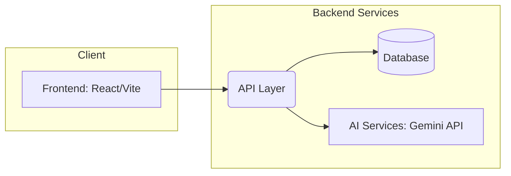

# EcoPulse 🌍

## 📖 Project Overview
**EcoPulse** is an intelligent, user-friendly platform designed to help individuals and organizations track, analyze, and reduce their carbon footprint. By leveraging advanced AI and intuitive design, EcoPulse transforms the complex task of emissions tracking into a seamless, engaging experience.

## ❓ Problem Statement
In the fight against climate change, awareness is the first step. However, calculating personal or organizational carbon footprints is often tedious, manual, and prone to inaccuracies. People lack a simple, automated way to extract carbon emission data from everyday activities (like electricity bills, fuel receipts, and shopping invoices) and visualize their environmental impact.

## ✨ Features
* **Smart Carbon Scanner**: Upload electricity bills, fuel receipts, or shopping invoices via drag-and-drop. The OCR-based scanner extracts text using AI and calculates your carbon footprint automatically.
* **Interactive Dashboard**: View your carbon metrics synced in real-time.
* **Smart Recommendations**: Get actionable insights on how to reduce your emissions.
* **History & Tracking**: Robust history-tracking feature to monitor your progress over time.
* **Gamification & Habit Tracking**: Earn XP, build streaks, and unlock levels by completing daily green actions.
* **Carbon Offset Simulator**: Simulate the impact of your contributions to green projects (tree planting, clean energy, plastic cleanup).
* **Premium UI/UX**: Built with modern design aesthetics, micro-animations, and glassmorphism.

## 📸 Screenshots
*(Add screenshots of the Smart Carbon Scanner, Interactive Dashboard, and Recommendations here)*

## 🏗️ Architecture Diagram


## 💻 Tech Stack
* **Frontend**: React 19, Vite
* **Styling**: Vanilla CSS (Premium Aesthetics)
* **Icons**: Lucide React
* **AI Integration**: Gemini Multimodal API (OCR & Data Extraction)
* **Testing**: Vitest, React Testing Library, jsdom
* **Tooling**: ESLint, Node.js

## 🚀 Installation Guide

1. **Clone the repository:**
   ```bash
   git clone https://github.com/your-username/ecopulse.git
   cd ecopulse
   ```

2. **Install dependencies:**
   ```bash
   npm install
   ```

3. **Set up environment variables:**
   Create a `.env` file in the root directory and add your Gemini API key and other configurations:
   ```env
   VITE_GEMINI_API_KEY=your_api_key_here
   ```

4. **Run the development server:**
   ```bash
   npm run dev
   ```

5. **Run Tests:**
   ```bash
   npm run test
   ```

## 🔒 Security Features
* **Environment Variable Protection**: Sensitive API keys and configurations are stored securely and never exposed to the client bundle.
* **Input Validation**: All manual and scanned data inputs are sanitized to prevent injection attacks.
* **Local Fallback**: Regex-based local fallback for text-only files ensures data processing can occur without always relying on external APIs, reducing data exposure.

## 🧪 Testing Strategy
* **Unit Testing**: Comprehensive unit tests for utility functions (like `carbonCalculations.js` and `scannerEngine.js`) using **Vitest**.
* **Component Testing**: Integration testing for React components (e.g., `CarbonScannerCard.jsx`, `RecommendationsCard.jsx`) utilizing **React Testing Library**.
* **Coverage Tracking**: Automated coverage reports using `@vitest/coverage-v8` to maintain high code quality standards.

## ♿ Accessibility Compliance
* **Semantic HTML**: Strict use of HTML5 semantic elements to ensure screen readers can navigate the site easily.
* **Keyboard Navigation**: Interactive elements (like the drag-and-drop uploader) are fully navigable via keyboard.
* **ARIA Attributes**: Applied to dynamic content and status indicators to provide context to assistive technologies.

## 🔭 Future Scope
* **Social Sharing**: Allow users to share their carbon reduction milestones on social media.
* **Organizational Accounts**: Scale the platform to support enterprise-level footprint tracking and ESG reporting.
